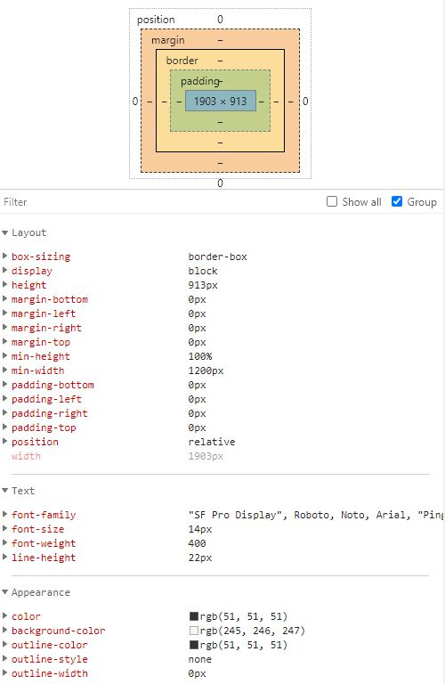

学习笔记

## CSS属性列表
脑图: ./CSS_Attributes.xmind

https://www.w3school.com.cn/cssref/index.asp  

## BFC(Block Formatting Context)和IFC(Inline Formatting Context)
格式化上下文
  格式化上下文即Formatting context，它是指页面上的一个局部独立渲染区域，根据Formatting context中包含的是元素类型的不同，分为块级格式上下文BFC和行内格式化上下文IFC，不同的格式化上下文对应着不同的渲染规则，来告诉页面多个Block-Level元素或是多个Inline-Level元素在页面中该如何布局。需要注意，在BFC中只会包含Block-Level元素，同样的，在IFC中只会包含Inline-Level元素。

引用：https://www.w3.org/TR/CSS21/visuren.html#block-formatting

### 块级格式化上下文BFC(Block Formatting context)
设置BCF的方法，下面这些元素都会产生一个新的BFC：
1. 根元素；
2. float属性不为none；
3. position为absolute或fixed；
4. display为inline-block, table-cell, table-caption, flex, inline-flex；
5. overflow不为visible；

### 行内格式化上下文IFC(Inlinel Formatting context)
IFC会随着Inline-Level元素的出现自动生成。
IFC会先将所有的元素一个个依次首尾相接排列到一起，合并成一个完整的流，然后再确定流中不可拆分的部分，最后将这个流拆分布局到多个不定宽度的line boxs。在上述这个由多个元素组成的留中，不可拆分的部分包括没有空格的连续字符串、单个英文或其他字符、可替换的Inline-Level元素。